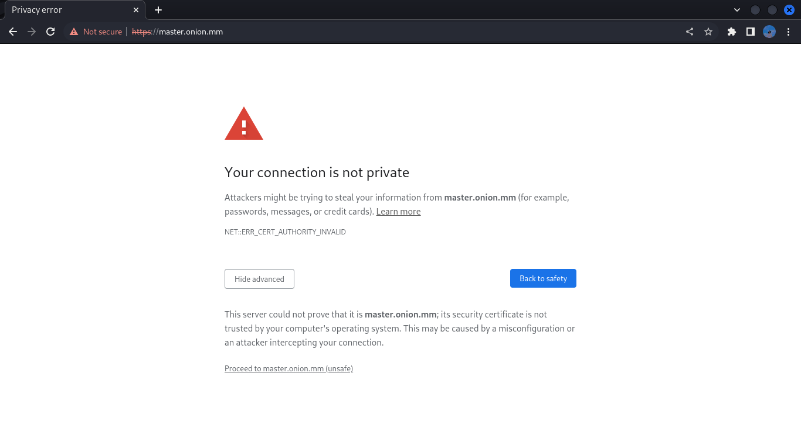

# Create SSL Certificate Authority for Local HTTPS Development
Creating your own certificate authority (CA) for your local servers so that you can run HTTPS sites locally without issue.

#
## Why HTTPS Locally?
Why not just use regular HTTP locally? Because if your production site is HTTPS-only and you're developing locally on regular HTTP, your development and production environments are not as similar as they could be.

You definitely want your development environment to mirror production as closely as possible. When it doesn't, you invite more issues showing up in production that didn't show up in development. Running HTTP when your production site is HTTPS-only is definitely an unnecessary risk. Even in a situation where you can't mirror your production environment perfectly, you’ll still want to run HTTPS locally, or you'll be fighting with mixed content SSL warnings all day long.

If you've ever tried to browse to a local site via HTTPS, which doesn’t have an SSL certificate configured, you've probably seen the following message in Chrome:



Other browsers have different messages, but the gist is the same.

One way to work around this is to switch your local WordPress development environment to something like LocalWP, DevKinsta, or even Laravel Valet which offer local SSL solutions out of the box. The downside is that this means changing your development workflow, not ideal if you are more comfortable with what you already have, especially if it already matches your production environment.

Searching for a local SSL solution online will often result in you going down the rabbit hole of self-signed certificates. However, trying to get a self-signed SSL certificate working with your local server kind of sucks if you're not using a tool that handles it for you, which brings you back to needing to switch local development environments.

The main problem with locally self-signed certificates is that they also need to be trusted by your browser. Just setting up a local self-signed certificate isn't enough. You end up with the same browser message, but this time with ERR_CERT_AUTHORITY_INVALID. This happens because the browser wants to check the validity of this certificate with a certificate authority, and can't. So the solution is to become your own CA!

#
## How It Works
To request an SSL certificate from a CA like Sectigo or GlobalSign, you send them a Certificate Signing Request (CSR), and they give you an SSL certificate in return that they have signed using their root certificate and private key. All browsers have a copy (or access to a copy from the operating system) of the root certificate from the various CAs, so the browser can verify that your certificate was signed by a trusted CA.

That’s why when you generate a self-signed certificate the browser doesn't trust it. It hasn’t been signed by a CA. The way to get around this is to generate our own root certificate and private key. We then add the root certificate to all the devices we own just once, and then all the self-signed certificates we generate will be inherently trusted.

#
## Becoming a (Tiny) Certificate Authority
With that set up, we're ready to generate the private key to become a local CA:
```
  openssl genrsa -des3 -out masterCA.pem 4096
```

OpenSSL will ask for a passphrase, which we recommend not skipping and keeping safe. The passphrase will prevent anyone who gets your private key from generating a root certificate of their own. The output should look like this:
```
  ┌──(akarit㉿god)-[~/…/paiakarit/notes/ssl/CA]
  └─$ openssl genrsa -des3 -out masterCA.key 4096
  Enter PEM pass phrase: Master@@#
  Verifying - Enter PEM pass phrase: Master@@#
```

Next, we generate a root certificate:
```
  openssl req -x509 -new -nodes -key masterCA.key -sha256 -days 3650 -out masterCA.pem
```

You will be prompted for the passphrase of the private key you just chose and a bunch of questions. The answers to those questions aren't that important. They show up when looking at the certificate, which you will almost never do. I suggest making the Common Name something that you’ll recognize as your root certificate in a list of other certificates. That's really the only thing that matters.
```
  ┌──(akarit㉿god)-[~/…/paiakarit/notes/ssl/CA]
  └─$ openssl req -x509 -new -nodes -key masterCA.key -sha256 -days 3650 -out masterCA.pem
  Enter pass phrase for masterCA.key: Master@@#
  You are about to be asked to enter information that will be incorporated
  into your certificate request.
  What you are about to enter is what is called a Distinguished Name or a DN.
  There are quite a few fields but you can leave some blank
  For some fields there will be a default value,
  If you enter '.', the field will be left blank.
  -----
  Country Name (2 letter code) [AU]:MM
  State or Province Name (full name) [Some-State]:Kachin State
  Locality Name (eg, city) []:Myitkyina
  Organization Name (eg, company) [Internet Widgits Pty Ltd]:Master Trust Services LLC
  Organizational Unit Name (eg, section) []:IT
  Common Name (e.g. server FQDN or YOUR name) []:MTS   
  Email Address []:paiakarit@gmail.com
```

You should now have two files: masterCA.key (your private key) and masterCA.pem (your root certificate).

🎉 Congratulations, you're now a CA. Sort of.

#
## Installing Your Root Certificate
To become a real CA, you need to get your root certificate on all the devices in the world. But we don't need to become a real CA. We just need to be a CA for the devices you own. We need to add the root certificate to any laptops, desktops, tablets, and phones that access your HTTPS sites. This can be a bit of a pain, but the good news is that we only have to do it once. Our root certificate will be good until it expires.

- ### Adding the Root Certificate to Chrome
  1. Open Chrome
  2. Got to Settings > Privacy and Security > Security > Manage Certificates > Authorities
  3. Click Import and Select your private key file (i.e masterCA.pem)
  4. Expand the Trust section
  5. It'll show you to check three box, check what you want.
  6. 🎉 Celebrate!

#
## Creating CA-Signed Certificates for Your Dev Sites
Now we're a CA on all our devices and we can sign certificates for any new dev sites that need HTTPS. First, we create a private key for the dev site. Note that we name the private key using the domain name URL of the dev site. This is not required, but it makes it easier to manage if you have multiple sites:
```
  openssl genrsa -out master.key 4096
```

Then we create a CSR:
```
  openssl req -new -key master.key -out master.csr
```

You'll get all the same questions as you did above and, again, your answers don't matter. In fact, they matter even less because you won't be looking at this certificate in a list next to others.
```
  ┌──(akarit㉿god)-[~/…/notes/ssl/domain/master.onion.mm]
  └─$ openssl req -new -key master.key -out master.csr
  You are about to be asked to enter information that will be incorporated
  into your certificate request.
  What you are about to enter is what is called a Distinguished Name or a DN.
  There are quite a few fields but you can leave some blank
  For some fields there will be a default value,
  If you enter '.', the field will be left blank.
  -----
  Country Name (2 letter code) [AU]:MM
  State or Province Name (full name) [Some-State]:Kachin State
  Locality Name (eg, city) []:Myitkyina
  Organization Name (eg, company) [Internet Widgits Pty Ltd]:Master LLC
  Organizational Unit Name (eg, section) []:IT
  Common Name (e.g. server FQDN or YOUR name) []:master.onion.mm
  Email Address []:root@master.onion.mm

  Please enter the following 'extra' attributes
  to be sent with your certificate request
  A challenge password []:Master@@#
  An optional company name []:Master LLC
```

Finally, we'll create an X509 V3 certificate extension config file, which is used to define the Subject Alternative Name (SAN) for the certificate. In our case, we'll create a configuration file called master.ext containing the following text:
```
  authorityKeyIdentifier=keyid,issuer
  basicConstraints=CA:FALSE
  keyUsage = digitalSignature, nonRepudiation, keyEncipherment, dataEncipherment
  subjectAltName = @alt_names

  [alt_names]
  DNS.1 = master.onion.mm
  DNS.2 = *.master.onion.mm
```

We'll be running openssl x509 because the x509 command allows us to edit certificate trust settings. In this case we're using it to sign the certificate in conjunction with the config file, which allows us to set the Subject Alternative Name.

Now we run the command to create the certificate: using our CSR, the CA private key, the CA certificate, and the config file:
```
  openssl x509 -req -in master.csr -CA masterCA.pem -CAkey masterCA.key \
  -CAcreateserial -out master.crt -days 365 -sha256 -extfile master.ext
```

We now have three files: master.key (the private key), master.csr (the certificate signing request, or csr file), and master.crt (the signed certificate). We can configure local web servers to use HTTPS with the private key and the signed certificate.